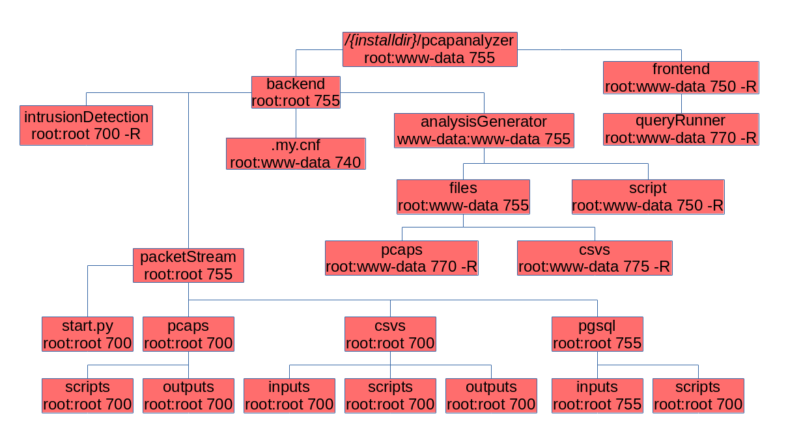

# Installing the server
Once all of the system requirements are met, you can proceed on installing your environment. First, you need to setup the main server environment.

## Server install

To install the server environment:

1. `git clone` the [PCAPAnalyzer installer repo](https://github.com/ivanol55/pcapanalyzer)
2. `cd` to the cloned repo on the `pcapanalyzer` folder
3. Navigate to the `install` folder
4. Run the `installer.py` script with `python3 installer.py`
5. When prompted, enter `s` or `S` to perform a full server install.
6. You will be asked to input a machineid. Choose a unique identifier for the host, like its hostname.
7. Input the directory where you want the system to be installed. This directory needs to be inside one of your webroots accessible by `apache2`.
8. Input the `postgresql` admin user to create the environment.
9. input the admin `postgresql` user password used to remotely connect to the system **[!] The password is not visible in plaintext in the terminal in this step while you write it. Be careful**
.
10. Input the IP address where the `postgresql` install is set up
11. Input the domain that the `apache2` virtualhost will listen on.
12. From the listed options, provide the system name of the interface you want the network sniffer to listen on. **[!] you can only have one listen entry. It cannot be set to `any`.**
13. When the install is done, you will be provided with the pcapanalyzer agent password. Save this password, because it will be stored on the .my.cnf file, and you will probably need it later.
14. You will be given a web frontend password for the `admin` account. **save these credentials**, because they are only stored on the database with a non-reversible cryptography algorithm and is not retrievable otherwise.
15. If you want to, enable data logging on the PCAPAnalyzer server with `service packetstream start`.

**[!] By default, the site is only http-enabled, and thus vulnerable to password sniffing. We strongly suggest enabling https with something like `certbot`, then enable the `HTTPOnly` flag on the main web frontend's `.htaccess` file.**

Once this installation is complete, you will have a functional PCAPAnalyzer install to use. To capture data from other machines, continue to the next section.

The resulting permission structure should be as follows:

